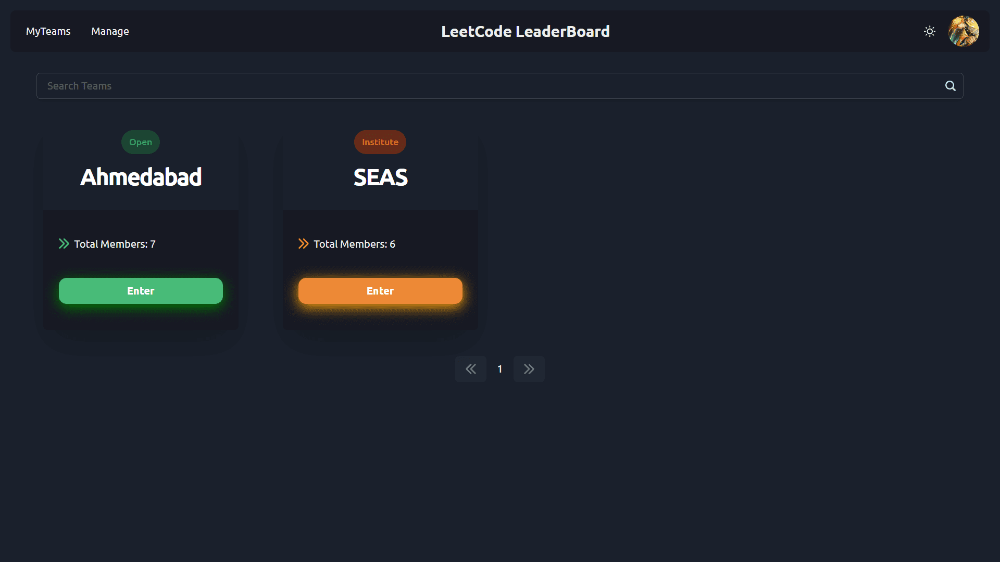

# LeetCode Leaderboard

A Leaderboard for LeetCode made in NextJS!

All you need is a leetcode username and you are good to go!

<!-- insert all the images from public/screenshots folder -->

# Features

1. You can view all available teams from the homepage:

2. You can view all your joined teams under **My Teams** sections:

3. The leaderboard for the team is displayed when you enter a team:

4. You can view your own profile and can also change your institution from here:

5. As an admin, you can manage the teams and add new teams in add

# Tech Stack:

## Frontend:

- React
- ChakraUI
- Framer Motion

## Backend:

- Vercel serverless functions
- MongoDB

# For further development:

### Pre-requisites:

- NodeJS
- MongoDB
- Typescript

### Required environment variables:

- `GOOGLE_CLIENT_ID`
- `GOOGLE_CLIENT_SECRET`
- `MONGO_URI`
- `NEXTAUTH_SECRET`
- `NEXT_PUBLIC_GA_MEASUREMENT_ID`
- `JWT_COOKIE_NAME`

### Steps to run:

- Clone the repo
- Run `npm install`
- Run `npm run dev`
